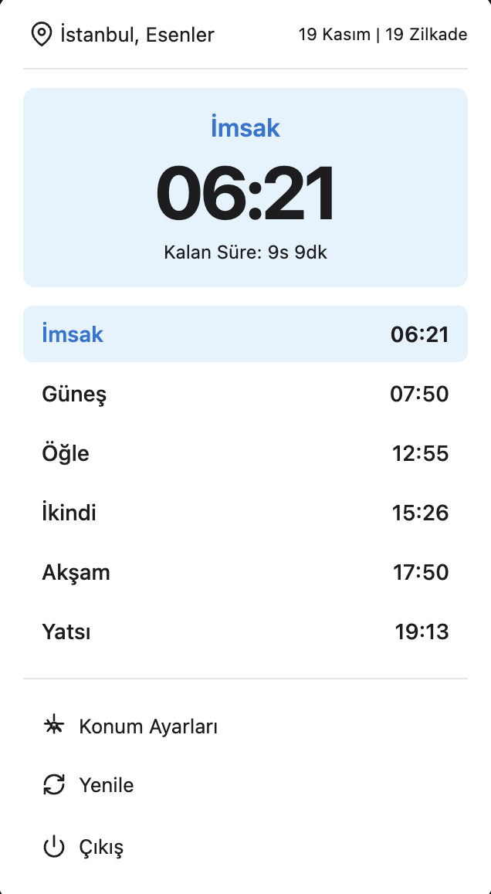

# Vakitler Menubar App

<div align="center">
  
  <p><em>macOS menübar'da çalışan Türkçe namaz vakitleri uygulaması</em></p>
  
  [](https://github.com/hakanyarman/vakitler-mac-menubar-app/releases/latest)
  [](https://github.com/hakanyarman/vakitler-mac-menubar-app/releases)
  [](LICENSE)
  [](https://github.com/hakanyarman/vakitler-mac-menubar-app)
  
  ### [📥 Download Latest Release](https://github.com/hakanyarman/vakitler-mac-menubar-app/releases/latest)
</div>

## Özellikler

- **Menübar'da bir sonraki namaz vaktine kalan süreyi anlık olarak gösterir - uygulamayı açmanıza gerek kalmaz**
- Günlük namaz vakitlerini gösterir (İmsak, Güneş, Öğle, İkindi, Akşam, Yatsı)
- Otomatik güncelleme (30 dakikada bir)
- Türkiye'nin tüm il ve ilçeleri için konum seçimi

## Ekran Görüntüleri

<div align="center">
  
  <p><em>Menübar'da kalan süre gösterimi</em></p>
</div>

<div align="center">
  
  <p><em>Tüm namaz vakitleri ve konum bilgisi</em></p>
</div>

## Kurulum

### Kullanıcılar için

[En son sürümü indirin](https://github.com/hakanyarman/vakitler-mac-menubar-app/releases/latest)

Mac tipinize uygun DMG dosyasını seçin:
- **Apple Silicon (M1/M2/M3):** `Vakitler Menubar App-x.x.x-arm64.dmg`
- **Intel Mac:** `Vakitler Menubar App-x.x.x.dmg`

Kurulum adımları:
1. DMG dosyasını indirin
2. DMG dosyasını çift tıklayarak açın
3. Uygulamayı Applications klasörüne sürükleyin
4. Uygulamayı başlatın

### İlk Açılışta Güvenlik Uyarısı

macOS, imzalanmamış uygulamalar için güvenlik uyarısı verir. Bu tamamen normaldir.

**Yöntem 1: Sağ tık ile açma**

1. Güvenlik uyarısında "Tamam" butonuna tıklayın
2. Finder > Applications klasöründe uygulamayı bulun
3. Uygulamaya sağ tıklayın (veya Control + Sol Tık)
4. "Open" seçeneğine tıklayın
5. Çıkan uyarıda tekrar "Open" butonuna tıklayın

**Yöntem 2: System Settings'den**

1. System Settings > Privacy & Security bölümüne gidin
2. "Vakitler Menubar App açılamıyor" yazısını bulun
3. Yanındaki "Open Anyway" butonuna tıklayın
4. Uygulamayı tekrar çalıştırın

Not: Bu uyarı sadece ilk açılışta çıkar.

### Geliştiriciler için

```bash
# Bağımlılıkları yükleyin
npm install

# TypeScript dosyalarını derleyin
npm run build

# Renderer dosyalarını kopyalayın
cp src/renderer/*.{js,html} dist/renderer/

# Uygulamayı çalıştırın
npm start

# Build alın (DMG + ZIP)
npm run package
```

## Kullanım

Uygulama başladığında menübar'da (saat yanında) görünür. İkona tıklayarak namaz vakitlerini görüntüleyebilirsiniz. Bir sonraki namaz vaktine kalan süre otomatik hesaplanır.

**Konum Ayarları**

Varsayılan olarak İstanbul için namaz vakitleri gösterilir. Kendi konumunuzu ayarlamak için:

1. Menübar ikonuna tıklayın
2. "Konum Ayarları" butonuna tıklayın
3. Şehir ve ilçe seçin
4. "Kaydet" butonuna tıklayın

Türkiye'nin 81 ili ve tüm ilçeleri kullanılabilir.

## Teknolojiler

- [Electron](https://www.electronjs.org/) - macOS menübar uygulaması
- [TypeScript](https://www.typescriptlang.org/) - Tip güvenli geliştirme
- [Axios](https://axios-http.com/) - HTTP istekleri
- [electron-store](https://github.com/sindresorhus/electron-store) - Konum ayarlarını kaydetme
- [Vakit API](https://vakit.vercel.app) - Namaz vakitleri API'si

## API ve Veri Kaynağı

Uygulama [Vakit API](https://vakit.vercel.app) kullanıyor. Diyanet İşleri Başkanlığı standartlarına uygun, Türkiye'nin tüm il ve ilçeleri için gerçek zamanlı güncel vakitler sağlar.

## Proje Yapısı

```
vakitler-menubar-app/
├── src/
│   ├── main.ts                      # Ana Electron process
│   ├── services/
│   │   └── vakit-api.ts            # Vakit API servisi
│   ├── types/
│   │   └── prayer-times.ts         # TypeScript tip tanımları
│   ├── config/
│   │   └── default-config.ts       # Varsayılan konum ayarları
│   └── renderer/
│       ├── popup.html              # Popup pencere
│       ├── popup-renderer.js       # Popup logic
│       ├── settings.html           # Ayarlar penceresi
│       └── settings-renderer.js    # Ayarlar logic
├── assets/
│   └── icon.icns                   # macOS app icon
├── dist/                            # Build çıktıları
├── package.json
├── tsconfig.json
└── README.md
```

## Geliştirme

### Debug Modu

```bash
# Watch mode ile TypeScript otomatik derler
npm run watch

# Başka bir terminalde uygulamayı çalıştırın
npm start
```

### Build

```bash
# Sadece TypeScript derle
npm run build

# macOS için paket oluştur
npm run package
```

Build sonrası `dist/` klasöründe şunlar oluşur:

- `Vakitler Menubar App-1.0.0-arm64.dmg` (Apple Silicon)
- `Vakitler Menubar App-1.0.0-arm64-mac.zip` (Apple Silicon)

## Sistem Gereksinimleri

- macOS 10.13 veya üzeri
- Apple Silicon (M1/M2/M3) veya Intel Mac
- ~225 MB disk alanı

## Lisans

MIT
